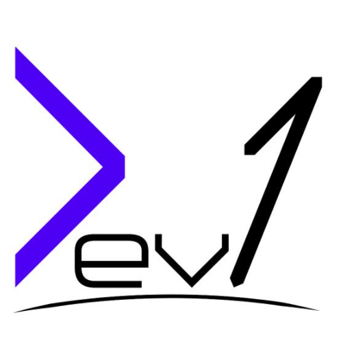
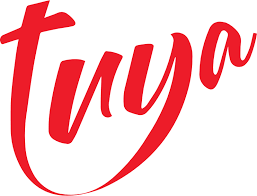

<!-- PROJECT LOGO -->
 

  
  

  <h3 align="center">Tuya Crowd Funding</h3>

  

    Una aplicación de inversiones en asociación con Tuya
     
    <a href="https://github.com/urregozw/Tuya_Crowdfunding/wiki"><strong>Explorar la Wiki »</strong></a>
     
     
    <a href="https://github.com/urregozw/Tuya_Crowdfunding/">Mirar un Demo</a>
    ·
    <a href="https://github.com/urregozw/Tuya_Crowdfunding/issues">Reportar un problema</a>
    ·
    <a href="https://github.com/urregozw/Tuya_Crowdfunding/issues">Sugerir una mejora</a>
  

<!-- TABLE OF CONTENTS -->
<h2 style="display: inline-block">Tabla de contenidos</h2>
  <ol>
    <li>
      <a href="#Sobre-el-proyecto">Sobre el proyecto</a>
      <ul>
        <li><a href="#Construido-con">Herramientas utilizadas</a></li>
      </ul>
    </li>
    <li><a href="#contributing">Contribuir</a></li>
    <li><a href="#license">Licencia</a></li>
    <li><a href="#contact">Contacto</a></li>
    <li><a href="#acknowledgements">Reconocimientos</a></li>
  </ol>

<!-- ABOUT THE PROJECT -->

## Sobre el proyecto

Esto es un proyecto en asociación con Tuya, para hacer un sistema de inversión e inversionistas realizado con Angular, .NET y MongoDB.

### Herramientas utilizadas

-   [.NET](https://github.com/dotnet)
-   [Angular](https://github.com/angular)
-   [MongoDB](https://github.com/mongodb/mongo)

<!-- CONTRIBUTING -->

## Contribuyendo

Las contribuciones son lo que hace que la comunidad de código abierto sea un lugar increíble para aprender, inspirar y crear. Cualquier contribución que hagas es muy apreciada. Para contribuir, el proyecto utiliza una estrategia basada en un [Forking Workflow.](https://www.atlassian.com/git/tutorials/comparing-workflows/forking-workflow)

Aqui puedes mirar como puedes contribuir a este proyecto: [GitHub Forking Workflow](https://gist.github.com/Chaser324/ce0505fbed06b947d962)

Antes de abrir cualquier **Pull Request** debes de utilizar las guías de estilo que estan dictadas en la wiki.
Dependiendo de a que capa del poryecto le hagas un **Pull request**, debes de utilzar los estilos de codigo que estan establecidos en la [wiki](https://github.com/urregozw/Tuya_Crowdfunding/wiki)

<!-- LICENSE -->

## Licencia

GNU GENERAL PUBLIC LICENSE Version 3. Mira `LICENSE` para más información.

<!-- CONTACT -->

## Contacto

Link del proyecto: [https://github.com/urregozw/Tuya_Crowdfunding](https://github.com/urregozw/Tuya_Crowdfunding)

<!-- ACKNOWLEDGEMENTS -->

## Reconocimientos

-   [ Juan Pablo Gómez ](https://github.com/jpgomezt)
-   [ Sebastian Urrego ](https://github.com/urregozw)
